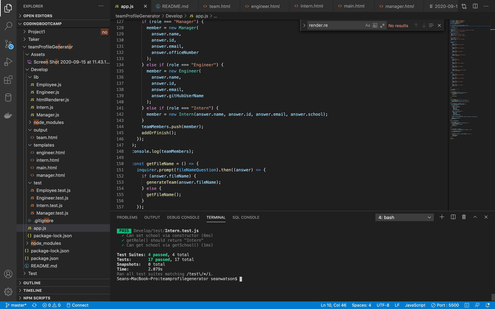
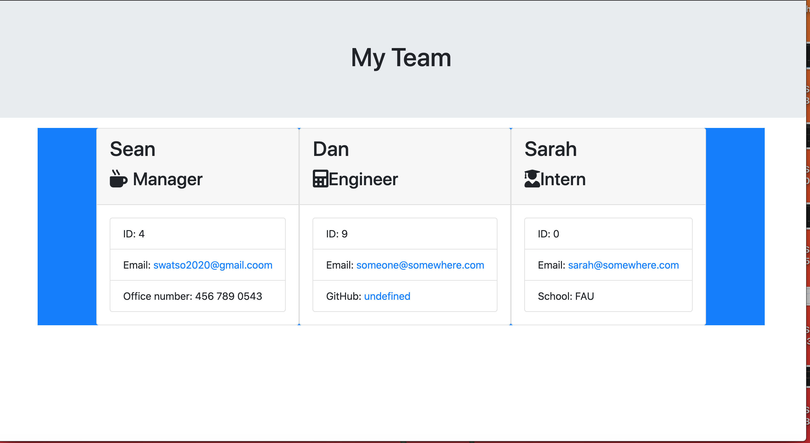

## About the Application
This is a engineering team generator. The application will prompt the user for information about the team manager and then information about the team members. The user can input any number of team members, and they may be a mix of engineers and interns.

## Video of working app
https://drive.google.com/file/d/1W1tuviTZ1m_pSPtMQFbuND0mAm14NaBW/view

## Passed Tests

## Screenshot of Team Roster

### Roster output

The project must generate a `team.html` page in the `output` directory, that displays a nicely formatted team roster. Each team member should display the following in no particular order:

  * Name

  * Role

  * ID

  * Role-specific property (School, link to GitHub profile, or office number)

